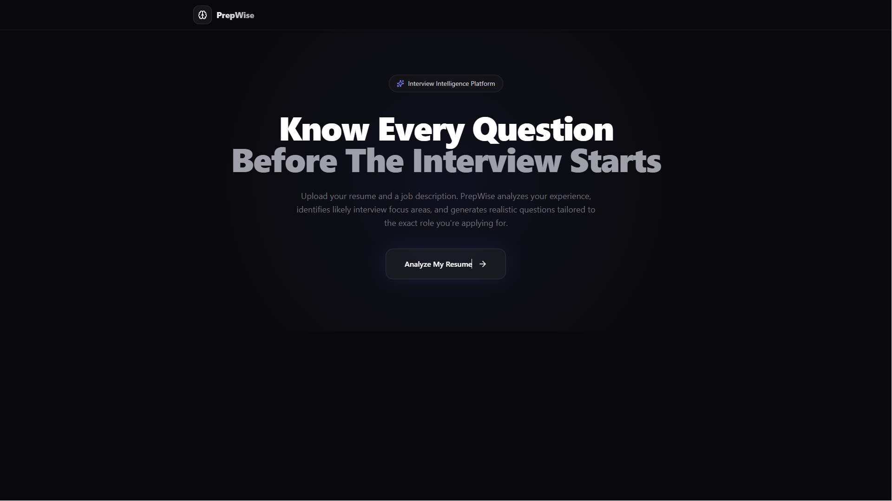

# PrepWise

PrepWise is an AI-powered interview preparation platform that generates personalized interview questions based on a candidate's resume and target job description.

Instead of practicing generic interview questions, users receive role-specific and resume-specific questions tailored to their skills, projects, experience, and the job they are applying for.

---

## Features

### Resume Analysis
- Upload resume in PDF format
- Extracts skills, technologies, projects, and experience
- Identifies likely interview focus areas

### Job Description Matching
- Analyze target role requirements
- Understand expected technologies and responsibilities
- Generate role-relevant interview questions

### Personalized Interview Preparation
- Technical Questions
- Resume-Based Questions
- Behavioral Questions
- HR & Culture Fit Questions

### Interactive Experience
- Modern dashboard UI
- Question search and filtering
- Copy interview questions instantly
- Download generated interview kit
- Practice answer workspace

---

## How It Works

1. Upload your resume
2. Paste the target job description
3. PrepWise analyzes both inputs
4. AI generates personalized interview questions
5. Practice using structured guidance and key discussion points

---

## Tech Stack

### Frontend
- Next.js 15
- React
- TypeScript
- Tailwind CSS
- Framer Motion

### Backend
- Next.js API Routes

### AI
- Google Gemini API

### File Processing
- PDF Parse

### Icons
- Lucide React

---

## Screenshots

### Landing Page



### Interview Setup


### Progress 


### Interview Report


---

## Installation

Clone the repository:

```bash
git clone https://github.com/YOUR_USERNAME/prepwise.git
```

Navigate to project directory:

```bash
cd prepwise
```

Install dependencies:

```bash
npm install
```

Create environment file:

```bash
.env.local
```

Add your API key:

```env
GEMINI_API_KEY=your_api_key_here
```

Run locally:

```bash
npm run dev
```

Open:

```txt
http://localhost:3000
```

---

## Project Structure

```txt
app/
├── page.tsx
├── workspace/
│   └── page.tsx

components/
├── HeroSection.tsx
├── ResumeUpload.tsx
├── JobDescriptionInput.tsx
├── LoadingOverlay.tsx
├── ResultsView.tsx
├── QuestionCard.tsx

lib/
├── ai.ts
├── pdf.ts
```

---

## Future Improvements

- Real role match scoring
- AI-generated interview feedback
- Mock interview mode
- Voice-based interview practice
- Company-specific interview preparation
- Progress tracking and analytics

---

## Motivation

Interview preparation is often generic and repetitive.

PrepWise was built to help candidates prepare for interviews using questions that are actually relevant to their background and target role, making preparation more focused, practical, and effective.

---

## Author

**Divyanshu Gairwal**
Computer science Graduate

---

## License

This project is licensed under the MIT License.