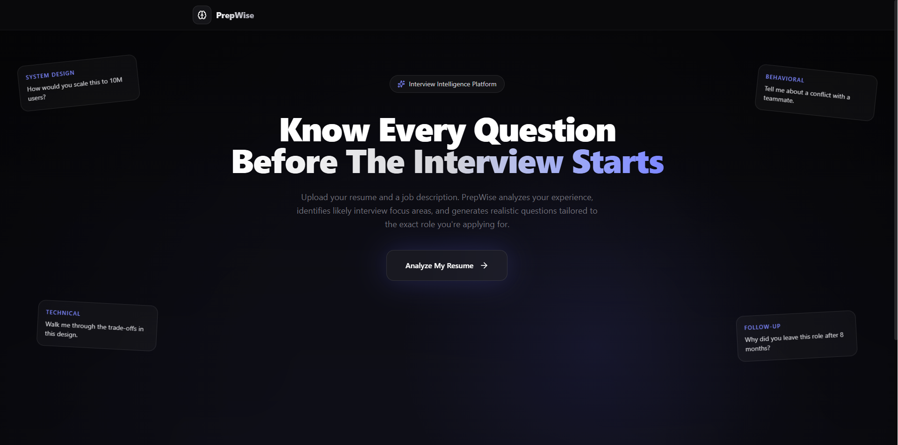
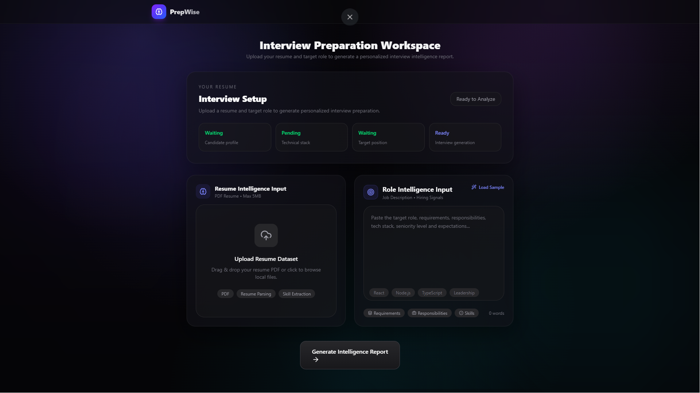
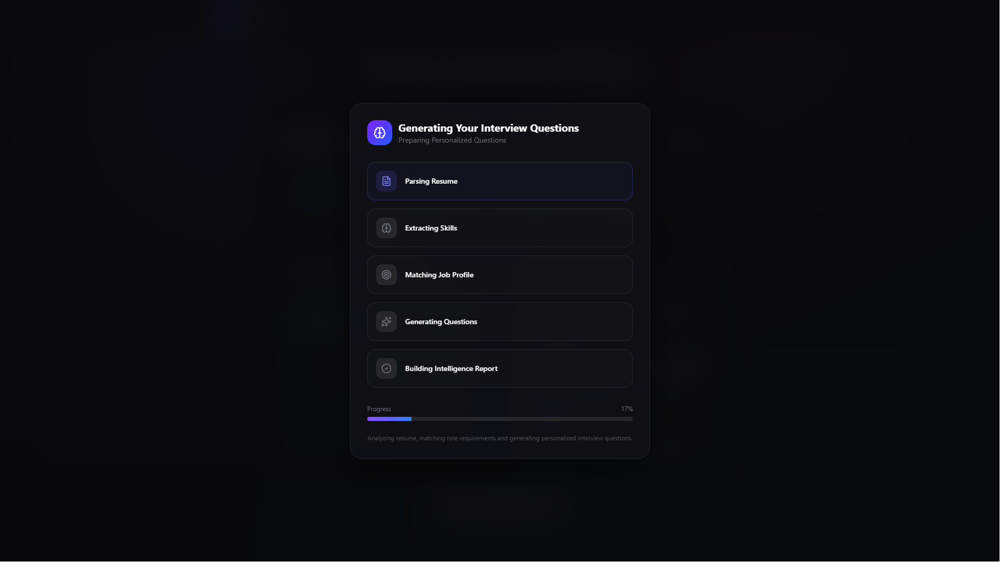
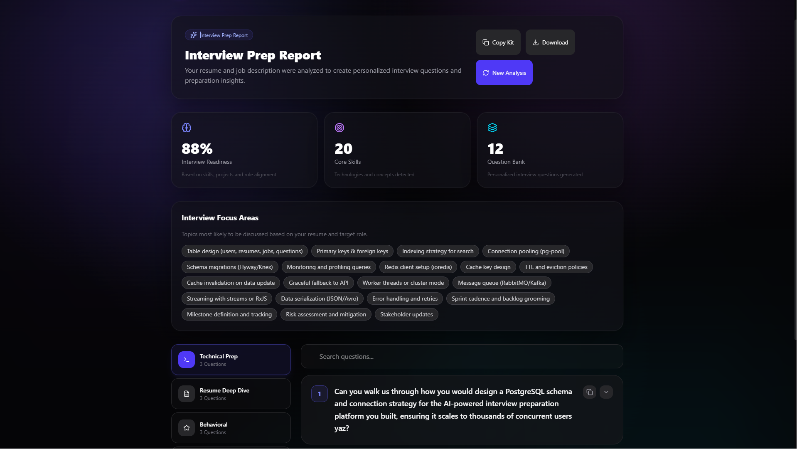

# PrepWise

PrepWise is an AI-powered interview preparation platform that generates personalized interview questions based on a candidate's resume and target job description.

Instead of practicing generic interview questions, users receive role-specific and resume-specific questions tailored to their skills, projects, experience, and the job they are applying for.

## Live Site

🌐 https://prepwise.cc

---

## Features

### Resume Analysis

* Upload resume in PDF format
* Extract skills, technologies, projects, and experience
* Identify likely interview focus areas

### Job Description Matching

* Analyze target role requirements
* Understand expected technologies and responsibilities
* Generate role-relevant interview questions

### Personalized Interview Preparation

* Technical Questions
* Resume-Based Questions
* Behavioral Questions
* HR & Culture Fit Questions

### Interactive Experience

* Modern dashboard UI
* Search and filter interview questions
* Expandable question cards
* Focus area insights
* Interview readiness indicators
* Structured interview preparation report

---

## How It Works

1. Upload your resume (PDF)
2. Paste the target job description
3. PrepWise extracts and analyzes resume content
4. AI compares your profile against the target role
5. Personalized interview questions are generated
6. Receive a complete Interview Prep Report

---

## Tech Stack

### Frontend

* Next.js 16
* React
* TypeScript
* Tailwind CSS
* Framer Motion

### Backend

* Next.js API Routes

### AI Layer

* OpenRouter API
* GPT OSS Models
* Gemma Models
* Multi-model fallback system

### File Processing

* pdf-parse

### Icons

* Lucide React

---

## Screenshots

### Landing Page



### Interview Setup



### Progress



### Interview Report



---

## Installation

Clone the repository:

```bash
git clone https://github.com/YOUR_USERNAME/prepwise.git
```

Navigate to the project directory:

```bash
cd prepwise
```

Install dependencies:

```bash
npm install
```

Create an environment file:

```bash
.env.local
```

Add your API key:

```env
OPENROUTER_API_KEY=your_api_key_here
```

Run the development server:

```bash
npm run dev
```

Open:

```txt
http://localhost:3000
```

---

## Project Structure

```txt
app/
├── page.tsx
│
├── workspace/
│   └── page.tsx
│
├── api/
│   └── analyze/
│       └── route.ts

components/
├── HeroSection.tsx
├── ResumeUpload.tsx
├── JobDescriptionInput.tsx
├── LoadingOverlay.tsx
├── ResultsView.tsx
├── QuestionCard.tsx
├── AnimatedCounter.tsx
├── PageTransition.tsx

lib/
├── ai.ts
├── pdf.ts

types/
├── index.ts
```

---

## Future Improvements

* Real role match scoring
* AI-generated interview summary
* Mock interview mode
* Voice interview practice
* Company-specific interview preparation
* Progress tracking and analytics
* Interview answer evaluation
* Personalized improvement suggestions

---

## Motivation

Most interview preparation platforms provide generic questions that do not reflect a candidate's actual background or the role they are targeting.

PrepWise was built to bridge that gap by combining resume analysis and job description analysis to generate personalized interview questions, helping candidates prepare more efficiently and confidently.

---

## Author

**Divyanshu Gairwal**

Computer Science Graduate

GitHub: https://github.com/DivyanshuGairwal

---

## License

This project is licensed under the MIT 
